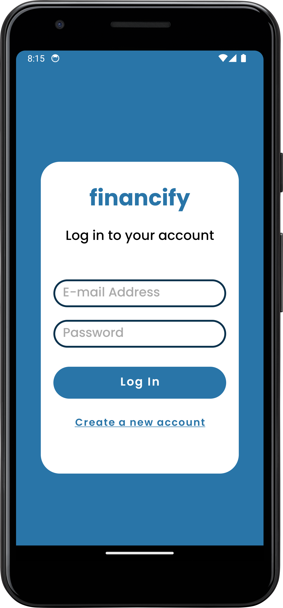
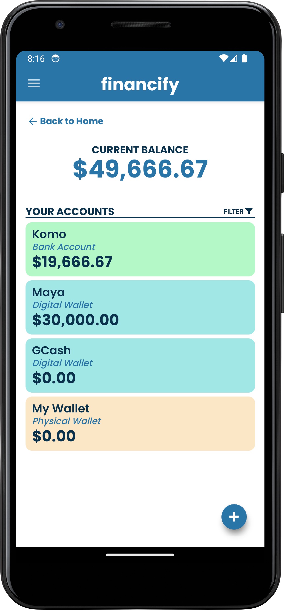
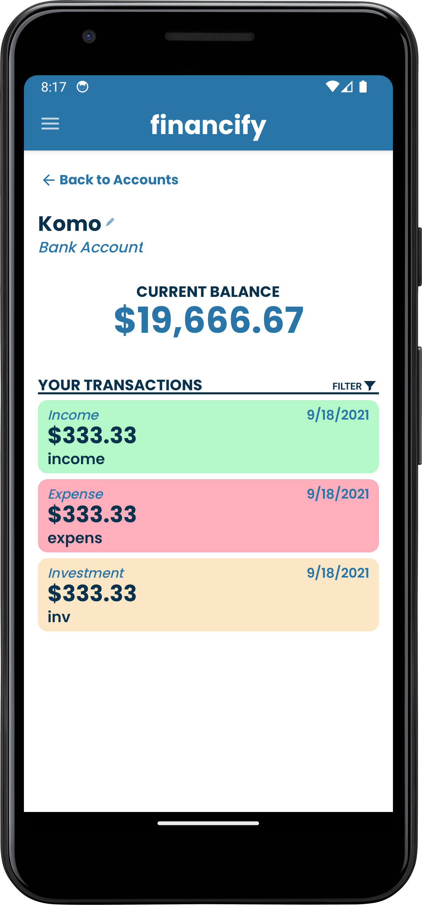
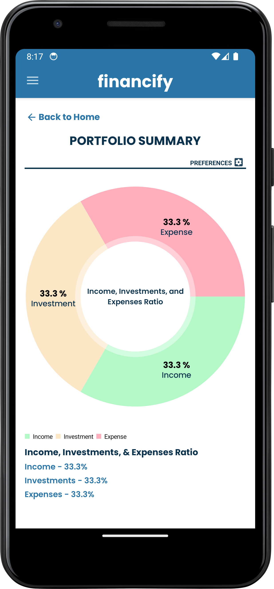
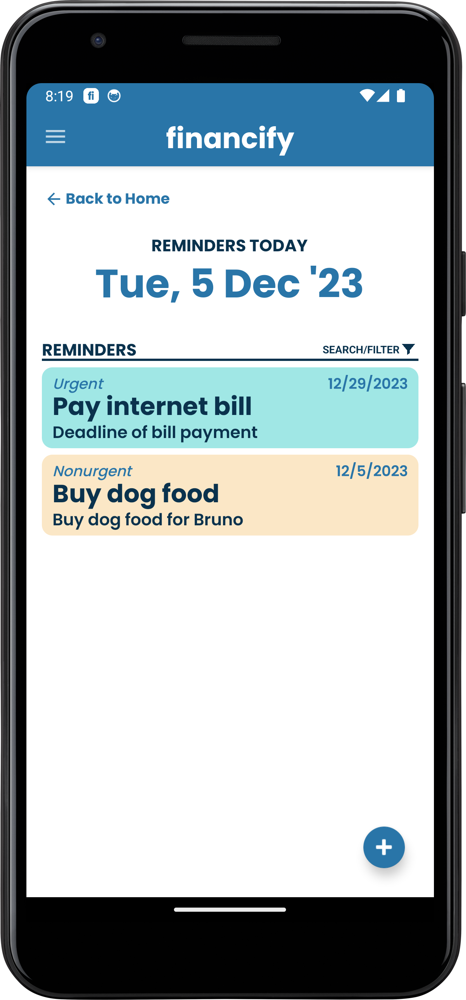

## What is Financify? 
**_Financify_** is a finance-tracking mobile application for everyone to use. It strives to simplify the daunting process of tracking all of your income, expenses, and investments. By using Financify, you will gain a better perspective of your financial situation as an individual, and ideally, you will be able to make better financial decisions in your daily life.

## Features:
- User Accounts
- Cash Flow Monitoring
- Portfolio Summary 
- Reminders
- Cloud Data Sync

## Authors:
- Andre Ponce
- Angel Lopez
- Joshue Jadie 

## Screenshots:

